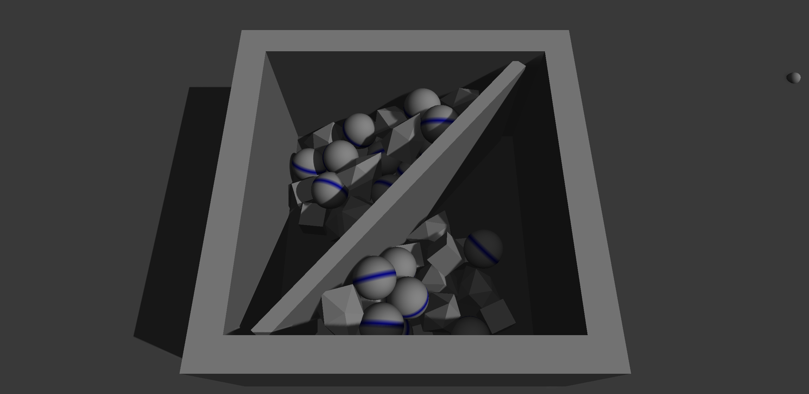
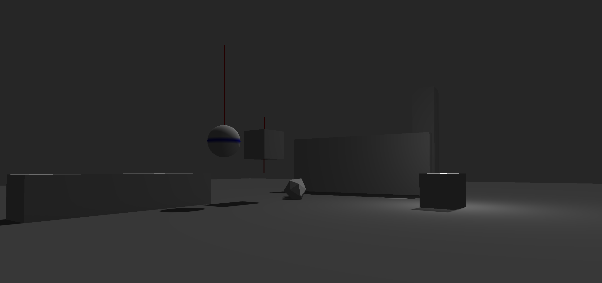

# Gigno  Game Engine

## Features

- Real-time 3D Renderer self written powered by Vulkan. Real-time shadows using Varianced Shadowmapping technique.
- Real-time 3D Physics engine self written using no external librariy. Supports various shapes (convex polygons, spheres, ...), as well as friction.
- Quick and iterative engine architecture inspired by the Source Engine : Devloper console commands for easy debugging, maps loaded from file with entity serialization to quickly iterate.




The engine is written in C++. 
It does not use OS-specific libraries. As such, (although it has only been tested on Windows 10/11), it should work anywhere !

## Getting started

Once in the app, use the tilde '~' key to open the console interface.
Type '```map```' for a list of map, and '```map <mapname>```' to load a specific map. 
Enjoy the show !

## Directly Running

If you just want to run the demo scene without compiling the code yourself, you may download the executable from the release section.

## Building from source

Either download the code of this repository or clone it recursively with the ```--recursive``` parameter ( there are submodules that must be included ).

### Vulkan SDK
A copy of the Vulkan SDK is required on your machine. You can download the Vulkan SDK at [this adress](https://vulkan.lunarg.com/).
Once you have downloaded the Vulkan SDK, open the CMakeLists.txt file and <b>replace the ```VULKAN_SDK_PATH``` value at line 7</b> :
```cmake
...

set(VULKAN_SDK_PATH C:/path_to_vulkan_sdk/VulkanSDK) # Change the path to reflect the one on your machine.

...
```

### GLFW
You must also install a copy of the glfw library. The glfw library is used to interface with the os, for Input/Output and window creation.
You can download the glfw library binaries at [this adress](https://www.glfw.org/download.html)
Once you have the glfw binaries, you must once again modify a path value in the CMakeLists.txt file.
This time, <b>replace the ```GLFW_PATH``` value at line 8</b>.
```cmake
...

set(GLFW_PATH C:/path_to_glfw/glfw-x.x.bin.PLATFORM) # Change the path to reflect the one on your machine.

...
```
Once you have done that, check the glfw files you have just downloaded. There should be inside a list of folders starting with ```lib-``` and containing dll files. 
Each of them correspond to a specific compiler used. Copy the name of the folder which correspond to the compiler you are going to use and <b>paste it in where ```GLFW_LIBRARY_FOLDER``` is defined, at line 9</b>.
```cmake 
...

set(GLFW_LIBRARY_FOLDER lib-compiler-platform) # This name reflects the compiler you are using.

...
```
### Shaders

The last step before code compilation is to compile the shaders. Go to the ```./assets/shaders``` directory and open compile_shaders.bat in your edior of choice. 
In it, replace the adress of the Vulkan SDK to reflect the one on your machine : 
```bat
C:\path_to_vulkan_sdk\VulkanSDK\Bin\glslc.exe simple_shader.vert -o simple_shader.vert.spv
C:\dev_libraries\VulkanSDK\Bin\glslc.exe simple_shader.frag -o simple_shader.frag.spv
```
Then, run the file or, if not on windows, copy each commands and run them through the terminal.
If everything works as expected, one .spv file will have been created for every other shader files that were present.
If it is the case, you are all set to begin compilling the code.


### Compile
The process for compiling the code follows the usual cmake process. If you do not have cmake installed, you can do so on [their website](https://cmake.org/download/).
As usual, open a command line interface in the directory of the engine and run the cmake initialisation commands :
```
mkdir BUILD
cmake -S . -B BUILD
```
And then, from the BUILD directory, call
```
cd BUILD
cmake ..
```
If everything goes well, all of the CMake files will be generated in the BUILD directory, as well as a copy of the assets folder and the gigno.exe executable.

#### Note
The executable requires the assets folder to be placed in the same dir as it to work.
The CMake compile process should copy these folders to the binary directory automatically but, in case it doesn't, you can do it mannualy.
The assets folder lies in the main directory of the project.

#### Note
Shader must be recompiled using ```compile_shaders.bat``` or the commands every time one is modified. 

## Libraries

This Engine uses the following low-level open-source, mostly MIT-Licensed libraries:
  - Vulkan as graphics API
  - GLFW for I/O with the OS, and window creation
  - ImGui for Immediate Mode User Interface
  - TinyObjectLoader for parsing 3D model files
  - GLM for math
  - minaudio for audio

See more information, including their license, in the [third_party_credits.md](src/vendor/third_party_credits.md) in the src/vendor directory.
